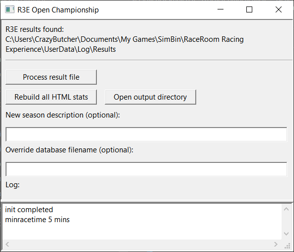

r3e-open-championship
=====================

Open Championship Statistics for [R3E](http://game.raceroom.com)
© 2015-2023 by Christoph Kubisch

### About

This is a small tool that parses the raceresult file from R3E and generates a tiny database and a html report for a championship based on multiple single race events (single- or multiplayer). It is not supported nor in anyway endorsed by the creators of R3E.

The tool supports either the raceresults.txt generated by R3E or json files by the server api.


As you can see at this [full sample website](http://htmlpreview.github.io/?https://github.com/pixeljetstream/r3e-open-championship/blob/master/doc/sample.html) it generates for every race:

* Driver Standings
* Team Standings (if more than one team)
* Vehicle Standings (if more than one vehicle type)
* Best Race Lap Times
* Best Qualification Times
* Detailed Race Results

### How it works 

#### Local Results

As of May 2023 Raceroom generates unique race result files in
`"My Documents\My Games\SimBin\RaceRoom Racing Experience\UserData\Log\Results"`
For example `2023_06_03_14_13_21_Race1.txt`. 

**Using UI**

Run the `r3e-open-championship.exe`



With the *"Process result file"* button you can select one or more result files to be processed. Watch out and **do not** select the old *raceresults.txt* that won't work anymore.

 The Log should update with a message like this (In the example we selected two files):

```
race parsed     BMW M4 GT3 faf1a3e8f004aedfe46addca2c22a742	2023/06/03 12:28:41
appendrace      results/BMW M4 GT3 faf1a3e8f004aedfe46addca2c22a742.lua
generate HTML   results/BMW M4 GT3 faf1a3e8f004aedfe46addca2c22a742.html
uniquedrivers used
race parsed     BMW M4 GT3 faf1a3e8f004aedfe46addca2c22a742	2023/06/03 14:13:45
appendrace      results/BMW M4 GT3 faf1a3e8f004aedfe46addca2c22a742.lua
generate HTML   results/BMW M4 GT3 faf1a3e8f004aedfe46addca2c22a742.html
uniquedrivers used
```


The database filename will be created based on all driver names that participated in the race. So keep it consistent whom you race against. You can override it through the text field. In the above example the automatic database name was `BMW M4 GT3 faf1a3e8f004aedfe46addca2c22a742`.

Races that have been processed before will be detected and won't be added to the database again. You would get a log message as following (example):

```
race parsed	BMW M4 GT3 faf1a3e8f004aedfe46addca2c22a742	2023/06/03 12:28:41
race already in database
```

Races that were too short will be rejected as well. By default 5 minutes is the minumum, and you can edit this in the `config.lua`.

Your next action typically would be to press *"Open output directory"* and double click the `html` file from your database to look at it in the browser.
In our example it would be `BMW M4 GT3 faf1a3e8f004aedfe46addca2c22a742.html`

**Using Commandline**

* Find the txt files inside  which contains the results of the last completed race (no matter what kind of race it was).
* Use appropriate commandline to add the race to a custom database file, or drop file on the `addautomaticrace.bat`.

#### Server Results

* For Multiplayer races it is highly recommended to pass the server generated result files (json or xml) and use the commandline mode, as it gives more control than the UI.

If you do not want to setup the commandline yourself, simply use the `myleague.bat`:

`myleague.bat 201602031038.json`

* Pass the json or xml file that the server generates onto it, for example drag drop the result file (json or xml) onto the batch file.
* This will append the results to a database called `myleague` and the result html is generated and then shown in your default browser. 
* By renaming the batch file, for example `GTR3 Summer Season.bat` you will also rename the database being used. So simply copy the batch file, rename it to the league it shall represent, and pass the result files onto it.
* Every time you pass a result file onto the batch, it will get appended to the database of that filename, so races only need to be added once.

### Commandline mode

In commandline mode, the ui is not started and core functionality is exposed.

* `-addrace dataBaseFile raceresultsFile`
  Appends the race to the provided database file (no error checking whether it 
  contains drivers from the race or not).

* `-makehtml dataBaseFile htmlFile`
  Generates html results for the provided database file
  
* `-addraceautodb raceresultsFile instructions`
  Parses the race and automatically generates the database file.
  If *instructions* string contains:
  - `html`, it will generate the html 
  - `show` it will open the html in the default browser.
  
* `-config "lua string"`
  Applies the lua string, overwriting the current settings. For example use `-config "ruleset='fia1962_1990'"` to apply old rulepoints prior adding a race to your custom season.
  
* `-configfile luaFile`
  Applies the config from this file, overwriting the current settings. By default `config.lua` is loaded.
  
  
For example:

One should prefer using luajit as startup, as it will print error outputs to console.

The following can be used as a batch file for managing multiplayer seasons.

```
luajit.exe r3e-open-championship.lua -config "ruleset='%3'" -addrace ./results/%1.lua %2 -makehtml ./results/%1.lua ./results/%1.html
```

The batch file expects three arguments, season file, result file (json, xml or txt) and ruleset for points in that race. It will add the results to the season and update the appropriate html file in the "results" subdirectory.

`mybatch.bat mygroup5 lastrace.json fia1962_1990`

### Configuration

To modify the HTML styling it's best to edit the `_style.css` file in '/results' or change the reference to your own file below. For league races it's recommended to disable the '#player' highlight color.

In the `config.lua` there is a few settings you can play with that affect the html generation:

* useicons: for track and car
* onlyicons: don't print text if icon exists
* driver_standings_vehicle: add vehicle column in driver standings
* driver_standings_team: add team column in driver standings
* vehicle_standings: print standings based on vehicle (automatically omitted if only one vehicle exists)
* team_standings: print standings based on teams (automatically omitted if only one team exists)
* stylesheetfile: change the default filename
* rulepoints: the table that is used to assign points to the drivers. The default entry must be provided, all others are optional, you can define your own analog to the ones that already exist. Just make sure the "ruleset" of a race within the easons matches an entry of the rulepoints table.

### Trouble Shooting / Handling Game Update

The `r3e-data.json` as well as the `assets.txt` file could get out of date, when the game is being updated and gets new content (tracks, cars etc.).

If there is errors about track or other content not being found try updating
`r3e-data.json`. You can find it in your Raceroom install (typically `Steam\SteamApps\common\raceroom racing experience\Game\GameData\General`) and replace the one that is in this directory.

Updating the assets (used for icons/thumbnails) works as follows (a bit more manual):

1. Open html source of https://game.raceroom.com/leaderboard using your browser (typically right-click in browser window, *"Show page source"*).
2. Save the source as `assets_raceroom_leaderboard.html` into the directory of this application
3. Run `update_assets.bat`. This will read the html file and update the `assets.txt` file, that contains the locations of the thumbnail / icon files used in the generated html.

Due to the changes or results handling around April and May 2023, some results / result databases may be incompatible for a brief moment. Names were exported in lower case, then upper case again, this would alter the database key, entries etc.

### History

Time-line for some distinct features
* 04.06.2023 - bugfixes, add ui button to process result files
* 03.06.2023 - Account for single player result files containing Ids.
  Added parsing of `r3e-data.json`.
  Added description how to update some key files.
* 06.05.2023 - add `addraceautomatic.bat` and new commandline options to create result database file automatically
* 03.05.2023 - start supporting new raceroom local result files for commandline mode (still subject to improvements)
* 28.12.2021 - the "Rebuild all HTML stats" function generates a `index.html` page in the output directory (thx to contribution by **blgk**) 
* 30. 9.2021 - json and xml fixes for latest file formating, base results on player.Position if exists, json/xml add support for race2 and race3
* 28. 2.2016 - xml result support, use time difference for best-lap and qualifying
*  6. 2.2016 - bugfix results when drivers are laps behind, remove minracetime check for json
* 17. 1.2016 - config file externalized, new config commandline, point handling per race
* 10. 1.2016 - json result bugfix racefinish state, config to disable team/vehicle standings
*  7.11.2015 - json result support to improve multiplayer usage
* 20. 6.2015 - multiplayer-friendly commandline options, and database override
* 14. 6.2015 - modified css styles a bit, allow position-based color-coding
* 13. 6.2015 - added icons for tracks and vehicles
* 16. 1.2015 - added optional description string for a championship
* 10. 1.2015 - added qual times, race results and driver standings with positions
*  9. 1.2015 - added team and car standings, as well as best laptimes
*  4. 1.2015 - first release, track multiple championship, html report for driver standings

### Third Party

Special thanks to **tAz-07** and **heppsan** from steam community on feedback and providing most of the track mappings. **ttfredo** and **Nicklas Petersson** from kwstudios forum for bug reproducers.

The icons are directly linked to the official game website.

The exe and wx dll were compressed via upx, the exe automatically executes the r3e-open-championship.lua file.

* [wxLua](http://wxlua.sourceforge.net/)
* [md5.lua](https://github.com/kikito/md5.lua)
* [upx](http://sourceforge.net/projects/upx/)
* [cjson](http://www.kyne.com.au/~mark/software/lua-cjson.php)
* [luajit](http://luajit.org/)
